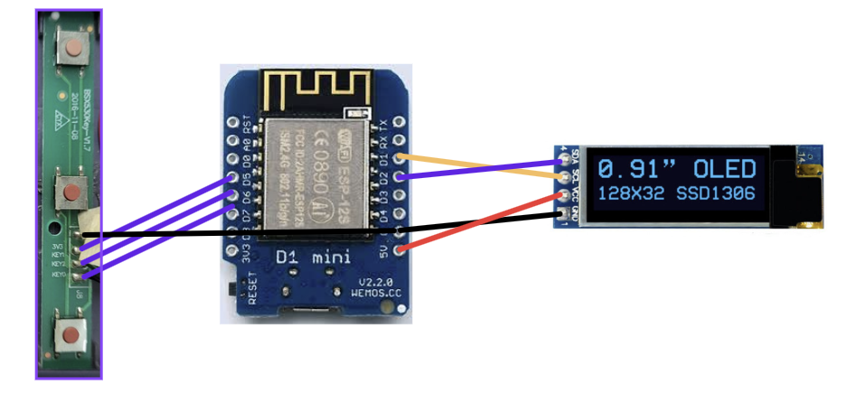

# Cheating Calculator – Hardware Mod (Electronics Experiment)

This project is a hardware electronics experiment where a standard calculator enclosure is modified to house a custom microcontroller-based system.

---

## Project Overview

The original calculator LCD is removed and replaced the solar panel with a 128×32 OLED display, interfaced via I2C with a Wemos D1 Mini (ESP8266). User input is handled using three tactile push buttons salvaged from an old blood pressure monitor.

To fit the additional electronics, minor internal plastic sections of the calculator casing were trimmed. This project represents the first functional prototype and serves as a proof of concept.

---

## Hardware Components Used

- Wemos D1 Mini (ESP8266)
- 128×32 OLED Display (I2C)
- Three tactile push buttons
- Modified calculator enclosure
- Jumper wires for temporary power

---
## Schematic

The internal schematic and wiring layout of the modified calculator is shown below.

## Design Choices

### OLED Display
Chosen for its compact form factor, low power consumption, and simple I2C interface.

### Push Buttons
Buttons were scavenged from an old blood pressure monitor to reduce cost and encourage component reuse. Standard tactile push buttons mounted on a zero PCB can also be used as an alternative.

### Enclosure Modification
Small internal plastic structures were carefully removed to create sufficient space for the OLED display and microcontroller.

---

## Power

The current prototype is powered using external wired connections.

### Planned Upgrade
- Integration of a compact battery
- Estimated battery backup of approximately two hours

---

## Internal View

Internal wiring and layout images are provided in the repository for reference.

---

## Project Status

- First iteration complete
- Battery integration planned
- Further layout and power optimizations pending
